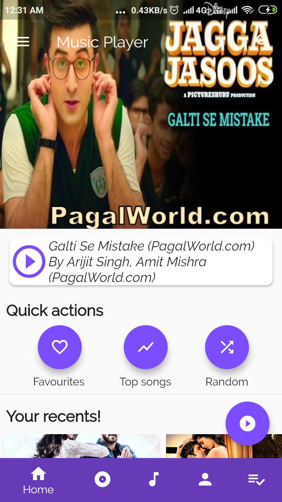
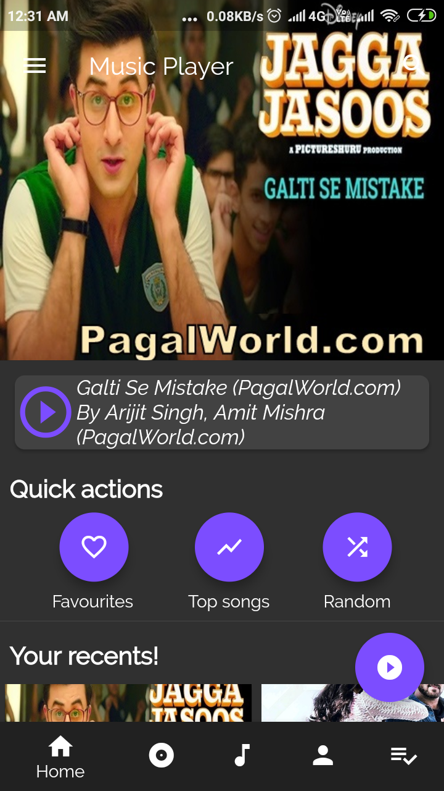
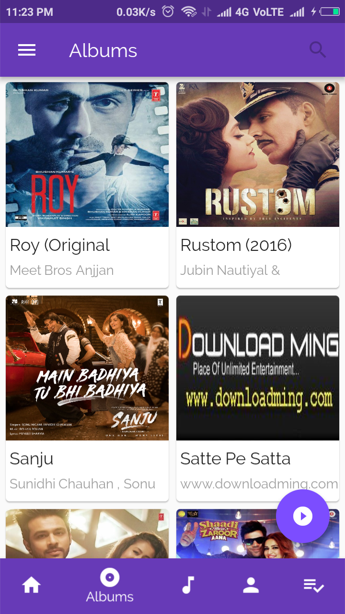
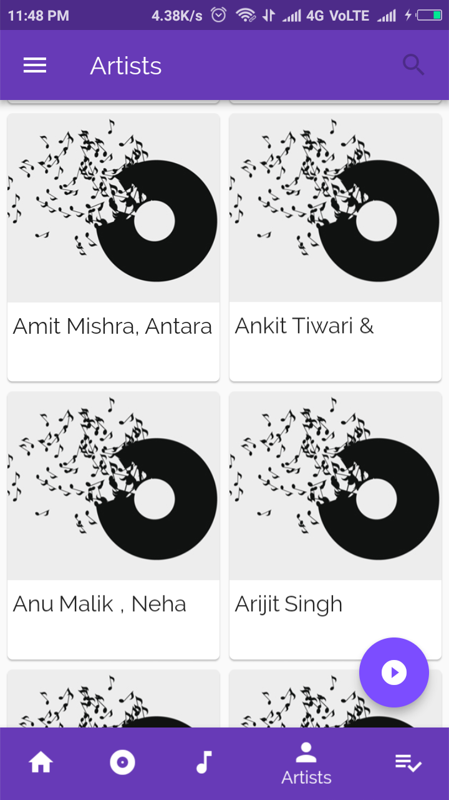
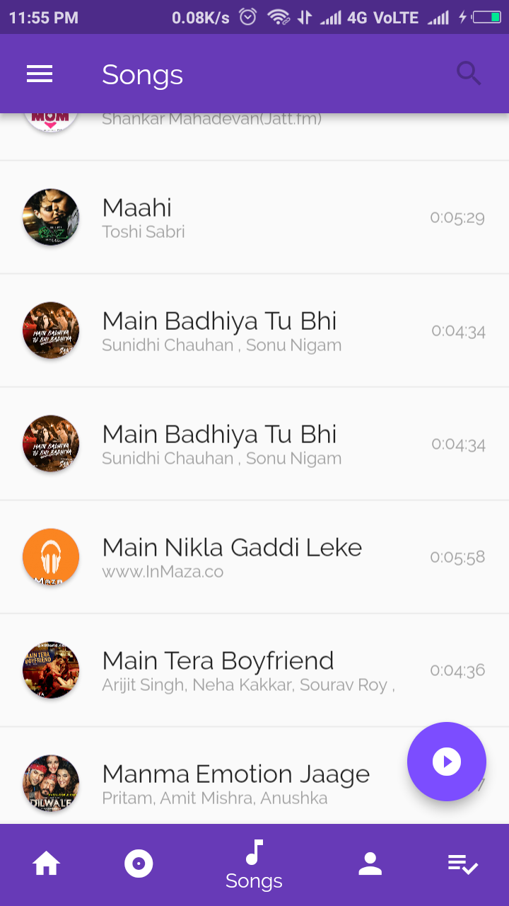
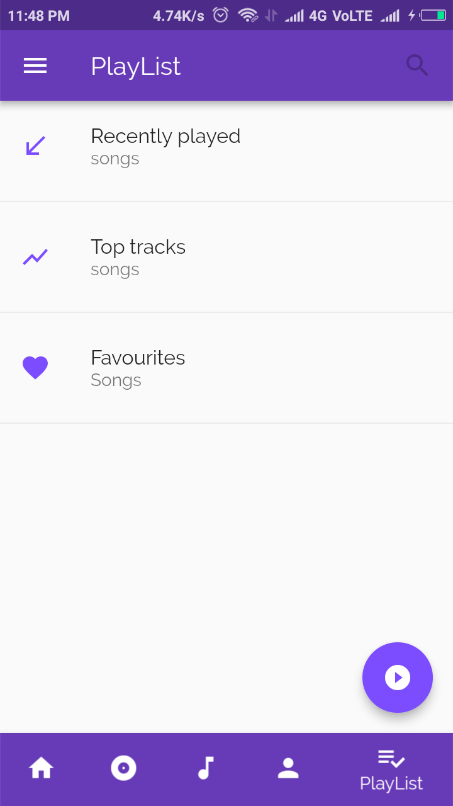
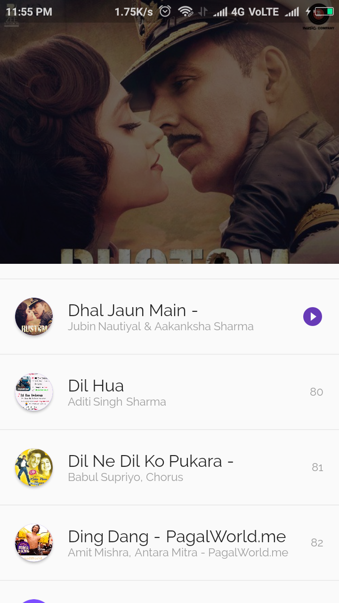
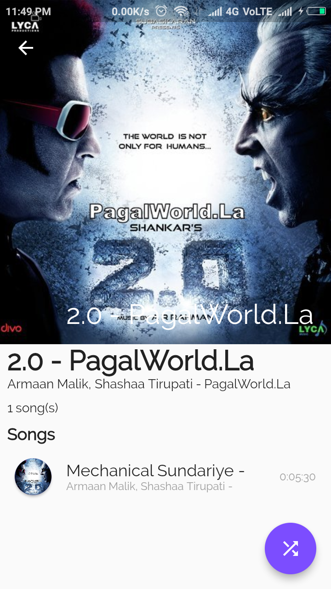
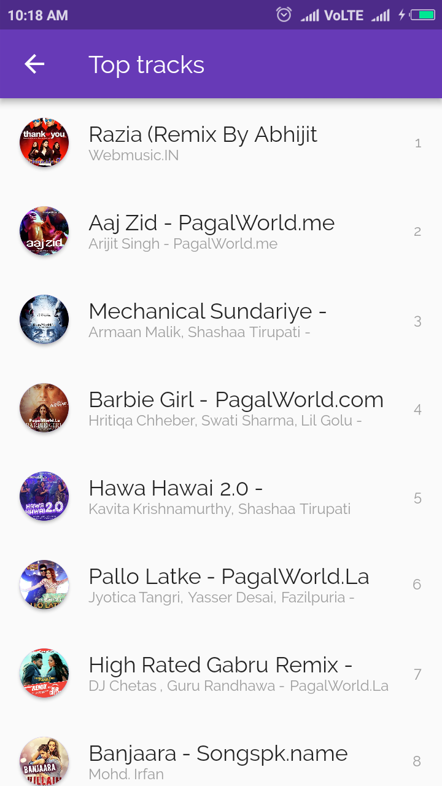
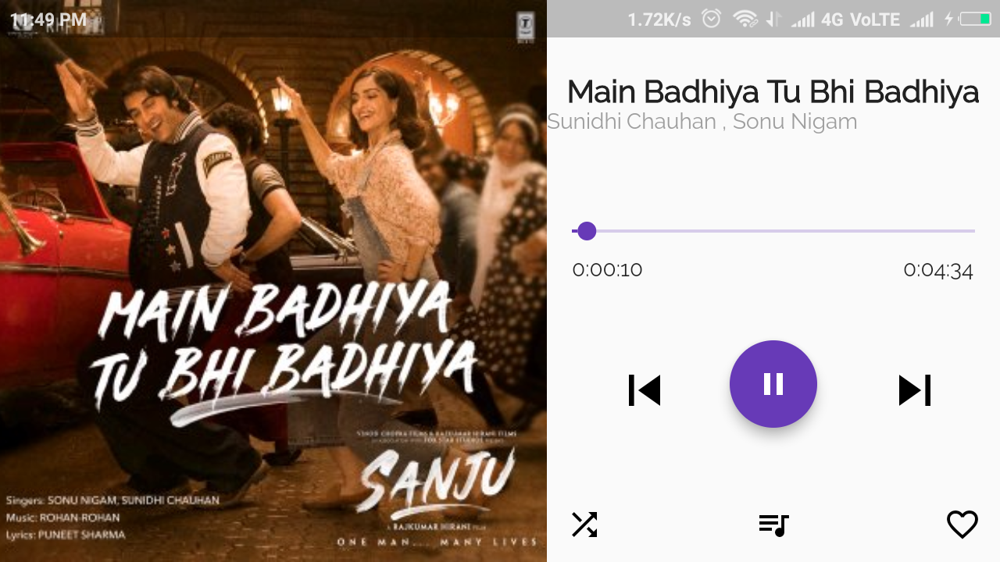

# Flutter Music Player

A complete and open source music player designed in flutter. It is first complete music player designed in flutter.
This app exploits Sqlite databse that enables faster loading of songs at startup. Only one time setup for loading songs is needed. This app comes with a lot of features and a more are coming soon.
 
 

# Features
<li> Play local songs
<li> Beautiful screens
<li> Sqlite database support
<li> Search songs, Songs suggestions
<li> Top tracks, Recent songs, Random song
<li> Album view, Artist view
<li> Playing queue, Shuffle, Add to favourites
<li> Play/pause, Next/prev
<li> Themes(dark/light), Custom font, Animations
<li> landscape mode

  
# Screenshots
<table>
  <tr>
    <td>
      
      Now playing
    </td>
    <td>
      
      Home Screen
      </td>
      <td>
      
         
     Dark Home Screen
      </td>
    </tr>
<!--   <tr>
      <td>
      
      Album
      </td>
    <td>
      
      Artist
      </td>
      <td>
      
      Songs
      </td>
    </tr>
  <tr>
      <td>
      
     PlayList
      </td>
      <td>
      
      Queue
      </td>
      <td>
      
     Album view
    </td>
    </tr>
  <tr>
       <td>
      
      Dark Now Playing
    </td>
      <td>
      
      Top tracks
      </td>
    <td>
      
      Landscape mode
    </td>
  </tr> -->
  </table>

